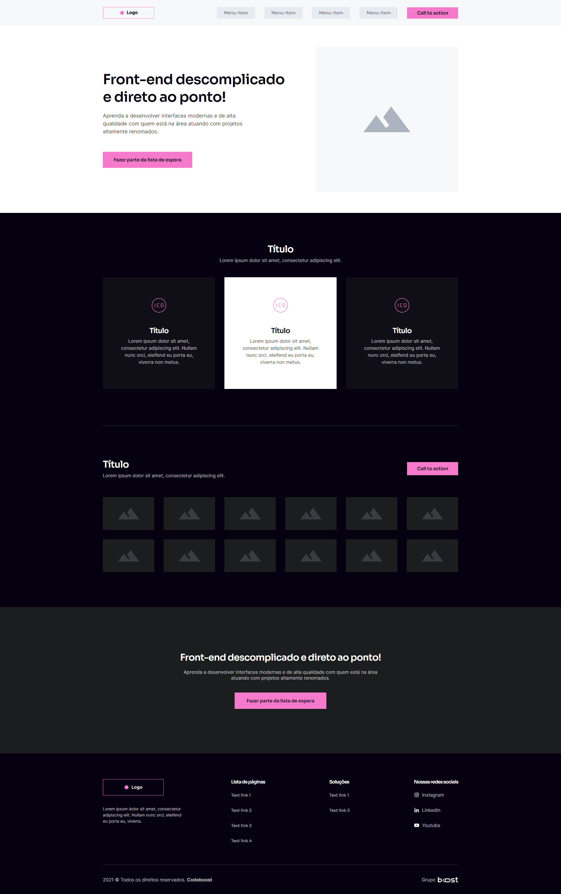

# Projeto Wireframe

Primeiro projeto do curso CodeBoost desenvolvido em HTML5 e CSS, com o intuito de fixa 
alguns conceitos teórico abordados durante o inicio do curso, nada melhor quer colocar
tudo em prática né 

## Screenshots

## Aprendizados

Ao construir o layout, percebi o quanto o flexBox é poderoso e facil de aplicar, 
bastas algumas linha de código e o layout está disposto seguindo fielmente o que foi 
planejado nas etapas anteriores. O criador e sua didatica tambem ajudou na fixação. Parabéns

## Autor e Criador(CodeBoost)

- [@WillMoreiraDev](https://www.github.com/WillMoreiraDev)

## 🔗 Links

